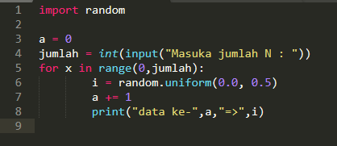
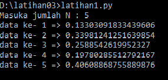
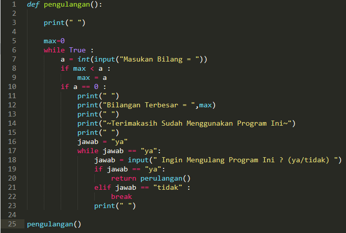
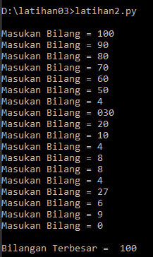
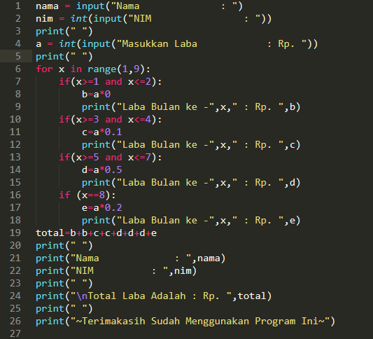
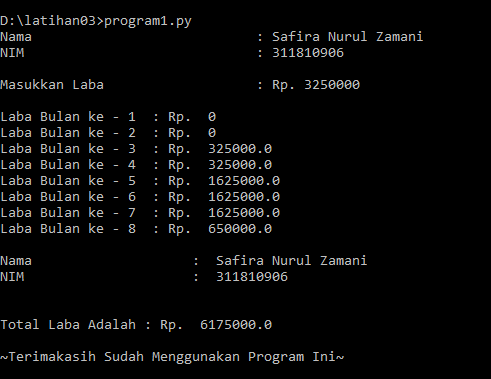

# Penjelasan Alur Algoritma Program **latihan1.py** , **latihan2.py** , dan **program1.py**

**Pertama Kita Bahas Alur Algoritma Program "Latihan1.py"**
**Menampilkan n bilangan acak yang lebih kecil dari 0,5**

- **Pengacakan, pembangkit bilangan acak, atau random** dapat digunakan untuk berbagai macam hal. Salah satu nya adalah untuk memecahkan kasus Monte Carlo. Nilai random kadang di butuhkan juga untuk menentukan seuatu pilihan. Atau digunakan juga untuk membuat id yang ditambahi dari string asal. Randomisasi juga dapat digunakan untuk mengacak suatu tampilan produk, atau digunakan saat proses pelatihan sebuah mesin cerdas. Di python untuk melakukan random cukup mudah.

		import random
			a = random.uniform()
			print(a)

- Perulangan **for**

Perulangan dor disebut juga sebagai counted loop (perulangan yang terhitung),yaitu perintah yang dieksekusi secara berulang berdasarkan jumlah perulangan tertentu.

		for x in range (start,stop)

**Hasil Output** >>>>>>>

# 

**Kedua Kita Bahas Alur Algoritma Program "Latihan2.py"**
**Menampilkan bilangan terbesar dari n buah data yang diinputkan**

- Perulangan **while**

Perulangan **while** disebut uncounted loop (perulangan yang tak terhitung),yaitu perulangan yang dilakukan berdasarkan kondisi tertentu selama nilai kondisi bernilai **TRUEE**.

		if a == 0 :
			break

**Hasil Output** >>>>>>>

# 

**Ketiga Kita Bahas Alur Algoritma Program "Program1.py"**

- Pernyataan **if**

Pada python dikenal penggunaan struktur kondisi menggunakan statement **if**, dimana format/syntax penggunaan statement **if** adalah :

		if (kondisi) :
			statement_truee

**Hasil Output** >>>>>>>

